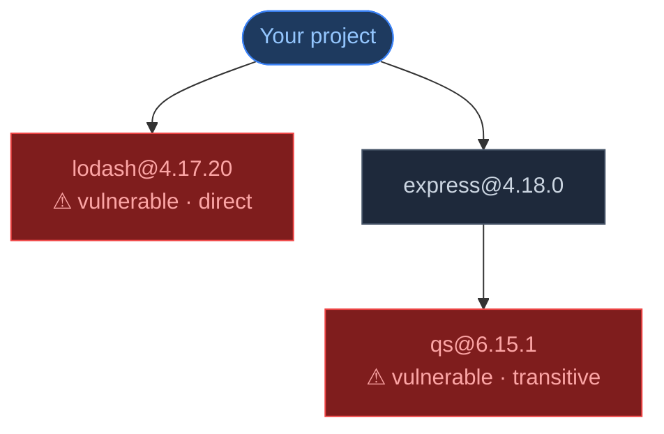
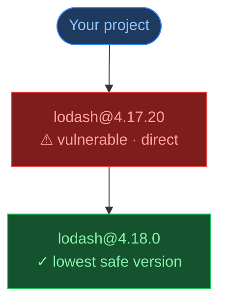
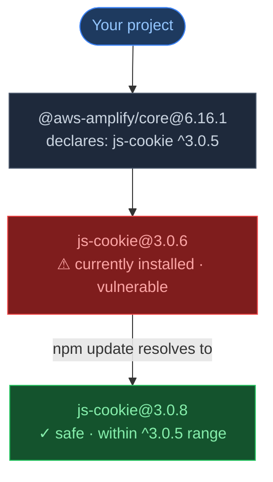
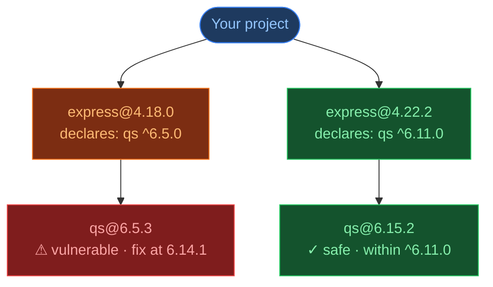
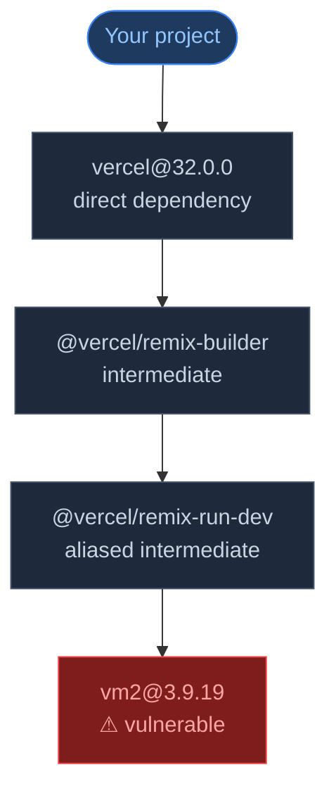
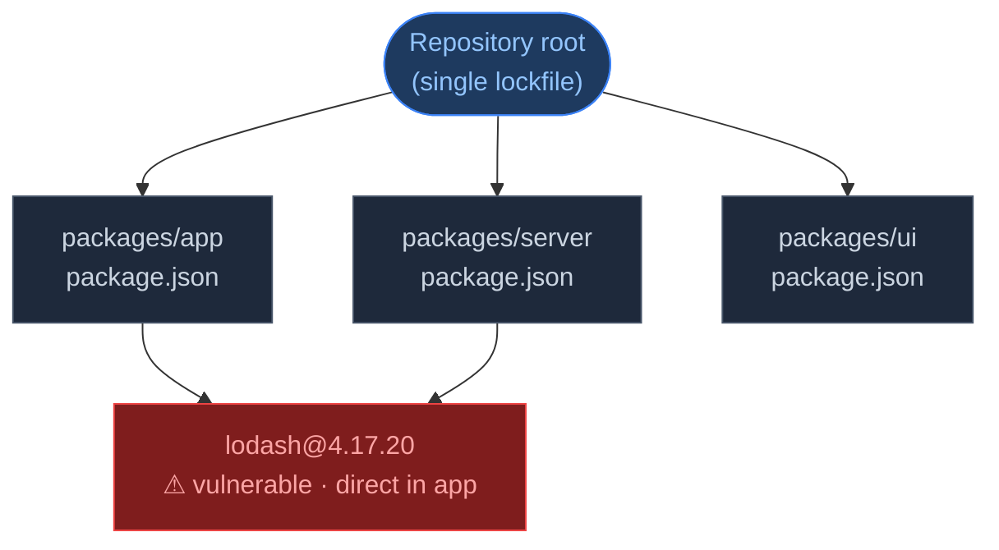
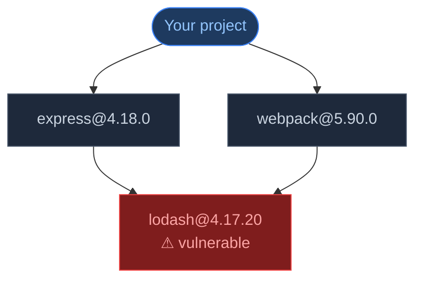
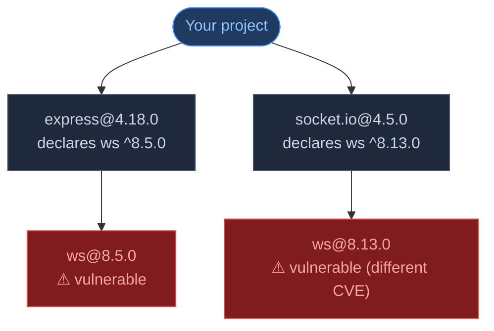
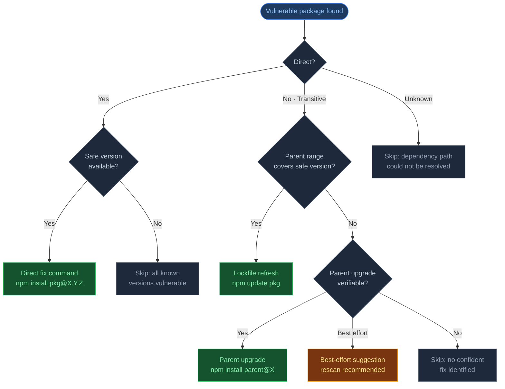

import Tabs from '@theme/Tabs';
import TabItem from '@theme/TabItem';

# How Remediation Works

CVE Lite CLI does more than list vulnerable packages — it figures out the most specific fix command it can confidently generate. This page explains the logic behind each type of suggestion with diagrams and real examples.

For deeper technical detail on parser behavior and package-manager-specific notes, see [Remediation Strategy](remediation-strategy).

---

## Smart remediation by design

Most security scanners hand you a list of vulnerable packages and leave the rest to you. CVE Lite CLI takes a different approach: for every finding, it evaluates the dependency graph and the npm registry to determine the **smallest, most targeted fix** it can verify.

That means:

- **A direct fix when possible** — if you installed the package yourself and a safe version exists, you get a direct upgrade command
- **A lockfile refresh when that's enough** — if the parent's declared range already covers a safe version, no `package.json` change is needed; just refresh the lockfile
- **A parent upgrade when necessary** — if the range itself needs to change, CVE Lite CLI finds the lowest parent version that resolves the issue
- **An honest skip when it can't be sure** — rather than guess, CVE Lite CLI tells you exactly why a finding has no confident fix

The result is a fix plan that does the minimum required — not a blanket "upgrade everything" that risks breaking your project.

---

## Understanding dependency resolution

Before diving into fix strategies, it helps to understand how JavaScript package managers work.

### What is a lockfile?

When you run `npm install`, the package manager reads your `package.json` to find out what you need, then resolves the full dependency tree — including all the packages your packages depend on — and writes the exact resolved versions to a lockfile (`package-lock.json`, `pnpm-lock.yaml`, `yarn.lock`, or `bun.lock`).

The lockfile is a snapshot. It records the exact version of every package that was installed at that moment in time. On future installs, the package manager uses the lockfile to reproduce the exact same set of packages rather than re-resolving everything from scratch.

**CVE Lite CLI reads the lockfile** — not `node_modules` on disk, not the npm registry. The lockfile is the authoritative record of what your project actually has installed.

### What do version ranges mean?

`package.json` declares version ranges, not exact versions:

| Range | Meaning |
|---|---|
| `^3.0.5` | Any version `>=3.0.5` and `<4.0.0` |
| `~3.0.5` | Any version `>=3.0.5` and `<3.1.0` |
| `>=3.0.5` | Any version `3.0.5` or higher |
| `3.0.5` | Exactly version `3.0.5` |

The caret (`^`) is by far the most common. `"js-cookie": "^3.0.5"` means the package manager is allowed to install any `3.x.x` version at or above `3.0.5`.

### Why can a lockfile have an old version if a newer one is allowed?

This is the source of a lot of confusion. If your lockfile says `js-cookie@3.0.6` but the declared range allows `3.0.8`, why isn't `3.0.8` installed?

Because the lockfile was written at the moment you last ran `npm install`, and `3.0.8` may not have existed yet. The lockfile pins the version that was resolved at that point in time. It does not automatically update when newer versions are published — that is intentional. Lockfiles exist specifically to make installs reproducible.

This is why `npm update <package>` exists — it refreshes the lockfile entry for a specific package to the highest version still permitted by the declared range, without changing `package.json`.

---

## Direct vs transitive dependencies

CVE Lite CLI classifies every vulnerable package as either **direct** (you installed it) or **transitive** (it arrived automatically as a dependency of something else). The fix strategy depends entirely on which it is.



**Direct** (`lodash`) — declared in your `package.json`. You installed it. CVE Lite CLI can suggest a fix command that upgrades it directly.

**Transitive** (`qs`) — pulled in automatically by `express`. You did not install it and cannot upgrade it by changing your own `package.json` alone. The fix depends on what `express` allows.

:::warning[Why not just install the transitive package directly?]

Running `npm install qs@6.15.2` adds `qs` as a direct dependency of your project but does not necessarily change what `express` resolves or uses internally. The lockfile may still contain the vulnerable copy under `express`. CVE Lite CLI always targets the correct layer of the dependency chain.

:::

---

## Case 1: Direct fix

When a vulnerable package is a direct dependency and a safe version is available, CVE Lite CLI suggests upgrading it directly.



CVE Lite CLI validates the target version against OSV before suggesting it — it scans published versions above the installed one and finds the **lowest** version that is no longer listed as vulnerable. The verbose output shows how many versions were scanned and how many are still known-vulnerable, so you can see the evidence behind the suggestion.

**Generated command:**

<Tabs groupId="package-manager">
  <TabItem value="npm" label="npm" default>
    ```bash
    npm install lodash@4.18.0
    ```
  </TabItem>
  <TabItem value="pnpm" label="pnpm">
    ```bash
    pnpm add lodash@4.18.0
    ```
  </TabItem>
  <TabItem value="yarn" label="yarn">
    ```bash
    yarn add lodash@4.18.0
    ```
  </TabItem>
  <TabItem value="bun" label="bun">
    ```bash
    bun add lodash@4.18.0
    ```
  </TabItem>
</Tabs>

:::note[Breaking changes]
When the suggested version crosses a major version boundary (e.g. `3.x` → `4.x`), CVE Lite CLI flags it as **Breaking?** in the output. Review the package's changelog before applying major upgrades.
:::

---

## Case 2: Lockfile refresh

When a vulnerable package is transitive but the immediate parent's declared range **already covers** a safe version, the lockfile just has an old resolved version pinned. No `package.json` change is needed — a lockfile refresh is enough.



The range `^3.0.5` permits `3.0.5`, `3.0.6`, `3.0.7`, `3.0.8` and above. The lockfile resolved to `3.0.6` when the project was last installed, but `3.0.8` is available and safe. CVE Lite CLI detects this by checking the parent's declared range against known safe versions — no `package.json` change needed, just refresh what the lockfile resolves to.

This is the preferred fix when it applies — it is the smallest possible change.

**Generated command:**

<Tabs groupId="package-manager">
  <TabItem value="npm" label="npm" default>
    ```bash
    npm update js-cookie
    ```
  </TabItem>
  <TabItem value="pnpm" label="pnpm">
    ```bash
    pnpm update --no-save js-cookie
    ```
  </TabItem>
  <TabItem value="yarn" label="yarn">
    ```bash
    yarn upgrade js-cookie
    ```
  </TabItem>
  <TabItem value="bun" label="bun">
    ```bash
    bun update js-cookie
    ```
  </TabItem>
</Tabs>

---

## Case 3: Parent upgrade

When the immediate parent's declared range does **not** cover a safe version of the vulnerable package, the parent itself needs to be upgraded to a version that ships with a wider or corrected range.



CVE Lite CLI fetches the parent's published version history from the npm registry and finds the lowest version where the declared range for the vulnerable package covers a safe version. This is why an internet connection is required for transitive remediation — the lockfile alone does not contain this information.

For pnpm, yarn, and bun, CVE Lite CLI uses a best-effort fallback rather than a full range graph. The suggested command may still require a rescan to confirm the fix landed.

**Generated command:**

<Tabs groupId="package-manager">
  <TabItem value="npm" label="npm" default>
    ```bash
    npm install express@4.22.2
    ```
  </TabItem>
  <TabItem value="pnpm" label="pnpm">
    ```bash
    pnpm add express@4.22.2
    ```
  </TabItem>
  <TabItem value="yarn" label="yarn">
    ```bash
    yarn add express@4.22.2
    ```
  </TabItem>
  <TabItem value="bun" label="bun">
    ```bash
    bun add express@4.22.2
    ```
  </TabItem>
</Tabs>

---

## Case 4: Best-effort (deep chains)

For dependency chains longer than two levels, CVE Lite CLI uses a best-effort approach. It checks whether upgrading the direct dependency forces an intermediate package to upgrade, which may transitively resolve the vulnerable package.



CVE Lite CLI looks for a version of the direct parent (`vercel`) that no longer allows the installed version of the immediate child, which is likely to force a chain of upgrades that resolves the vulnerable package.

Best-effort suggestions are labelled in the output. CVE Lite CLI recommends rescanning after applying them to confirm the vulnerability was resolved.

```bash
cve-lite .   # see the suggestion
```

Apply the suggested command for your package manager:

<Tabs groupId="package-manager">
  <TabItem value="npm" label="npm" default>
    ```bash
    npm install vercel@32.1.0
    ```
  </TabItem>
  <TabItem value="pnpm" label="pnpm">
    ```bash
    pnpm add vercel@32.1.0
    ```
  </TabItem>
  <TabItem value="yarn" label="yarn">
    ```bash
    yarn add vercel@32.1.0
    ```
  </TabItem>
  <TabItem value="bun" label="bun">
    ```bash
    bun add vercel@32.1.0
    ```
  </TabItem>
</Tabs>

```bash
cve-lite .   # confirm it's resolved
```

---

## Workspaces

Modern JavaScript projects are often **monorepos** — a single repository containing multiple packages, each with their own `package.json`. Tools like npm workspaces, pnpm workspaces, and Yarn workspaces link these packages together under a single lockfile.



**A fix must target the right workspace.** Running `npm install lodash@4.18.0` at the root installs lodash in the root `package.json`, not in `packages/app` where the vulnerability actually lives. CVE Lite CLI detects workspace structure from the lockfile and automatically scopes fix commands to the correct workspace:

<Tabs groupId="package-manager">
  <TabItem value="npm" label="npm" default>
    ```bash
    npm install -w packages/app lodash@4.18.0
    ```
  </TabItem>
  <TabItem value="pnpm" label="pnpm">
    ```bash
    pnpm add --filter ./packages/app lodash@4.18.0
    ```
  </TabItem>
  <TabItem value="yarn" label="yarn">
    ```bash
    yarn workspace app add lodash@4.18.0
    ```
  </TabItem>
  <TabItem value="bun" label="bun">
    ```bash
    bun add --filter packages/app lodash@4.18.0
    ```
  </TabItem>
</Tabs>

**The same package can be direct in one workspace and transitive in another.** CVE Lite CLI tracks dependency paths per workspace and generates the appropriate fix for each.

---

## Multiple parents, same vulnerable version

The same vulnerable package version is often pulled in by more than one parent. For example, both `express` and `webpack` might depend on `lodash@4.17.20`.



CVE Lite CLI reports this as **one finding** — `lodash@4.17.20` — not two. The finding includes all known dependency paths so you can see every route through which it arrives. The fix command targets the package once and covers all paths simultaneously.

**Generated command:**

<Tabs groupId="package-manager">
  <TabItem value="npm" label="npm" default>
    ```bash
    npm install lodash@4.18.0
    ```
  </TabItem>
  <TabItem value="pnpm" label="pnpm">
    ```bash
    pnpm add lodash@4.18.0
    ```
  </TabItem>
  <TabItem value="yarn" label="yarn">
    ```bash
    yarn add lodash@4.18.0
    ```
  </TabItem>
  <TabItem value="bun" label="bun">
    ```bash
    bun add lodash@4.18.0
    ```
  </TabItem>
</Tabs>

---

## Multiple parents, different versions of the same package

Sometimes the same package is installed at two different versions because different parents declare incompatible ranges. npm installs both versions in separate locations in `node_modules`.



CVE Lite CLI reports these as **two separate findings** — `ws@8.5.0` and `ws@8.13.0` — because they are different installed versions with potentially different vulnerabilities and different fix targets. Each gets its own fix path independently.

**Generated commands (one per finding):**

<Tabs groupId="package-manager">
  <TabItem value="npm" label="npm" default>
    ```bash
    npm install express@4.21.0
    npm install socket.io@4.7.5
    ```
  </TabItem>
  <TabItem value="pnpm" label="pnpm">
    ```bash
    pnpm add express@4.21.0
    pnpm add socket.io@4.7.5
    ```
  </TabItem>
  <TabItem value="yarn" label="yarn">
    ```bash
    yarn add express@4.21.0
    yarn add socket.io@4.7.5
    ```
  </TabItem>
  <TabItem value="bun" label="bun">
    ```bash
    bun add express@4.21.0
    bun add socket.io@4.7.5
    ```
  </TabItem>
</Tabs>

Or if both parents' declared ranges already cover a safe `ws` version, CVE Lite CLI may instead suggest a single lockfile refresh for both:

<Tabs groupId="package-manager">
  <TabItem value="npm" label="npm" default>
    ```bash
    npm update ws
    ```
  </TabItem>
  <TabItem value="pnpm" label="pnpm">
    ```bash
    pnpm update --no-save ws
    ```
  </TabItem>
  <TabItem value="yarn" label="yarn">
    ```bash
    yarn upgrade ws
    ```
  </TabItem>
  <TabItem value="bun" label="bun">
    ```bash
    bun update ws
    ```
  </TabItem>
</Tabs>

The same package name appearing twice in your scan output is not a duplicate — it means the package was installed at two distinct versions through different parents, each requiring its own resolution.

---

## Offline mode

When running with `--offline` or `--offline-db`, CVE Lite CLI cannot make registry calls. This affects transitive remediation:

- **Direct fixes** still work — the advisory data comes from the local database, and the fix hint is used directly without registry validation
- **Lockfile refreshes** still work — the parent range check uses data already in the lockfile
- **Parent upgrades** are not available — finding the right parent version requires fetching published version history from the registry

To sync the local advisory database before going offline:

```bash
cve-lite advisories sync
cve-lite . --offline
```

---

## What CVE Lite CLI shows in the output

Run `cve-lite . --verbose` to see the full fix plan. For each fix command, the **Context** column explains which path CVE Lite CLI used and why — parent name, dependency path, and confidence level. The **Coverage** line at the bottom tells you how many of your findings are covered by the generated commands.

For findings with no fix command, a **Skipped** section shows the exact reason each one was skipped.

---

## When CVE Lite CLI skips a finding

Not every finding gets a fix command. CVE Lite CLI explicitly skips findings it cannot confidently resolve and explains why in the output.



Skipped findings always appear in the output with an explicit reason — CVE Lite CLI never silently drops a vulnerability.

Common skip reasons:
- No safe version exists for this package (all published versions are still vulnerable)
- The dependency path could not be resolved from the lockfile
- Running in offline mode and registry data is required for this fix type
- The parent has no newer published version that resolves the vulnerable child

---

## Malicious package advisories (MAL-)

OSV includes a separate class of advisory for packages that were intentionally published with malicious code. These carry a `MAL-` prefix in their advisory ID (for example, `MAL-2026-3744`).

CVE Lite CLI handles MAL- findings differently from CVE/GHSA findings because the nature of the risk is different:

- **CVE/GHSA:** The vulnerability is in the package's code logic. `lodash@4.17.20` has a prototype pollution bug whether it came from the public npm registry or your private Artifactory mirror. The version is what matters.
- **MAL-:** The maliciousness *is* the artifact. A specific package published to the public npm registry at a specific version contained injected malicious code. If your private registry has a package with the same name and version, it is a completely different artifact - the MAL- advisory may not apply.

### Unverifiable (private source)

When CVE Lite CLI detects that a package with a MAL- advisory resolved from a URL other than `https://registry.npmjs.org/`, it cannot confirm whether the advisory applies to your artifact. Instead of reporting a false-positive "Malicious" finding, it surfaces the finding as:

```
⚠ Unverifiable (private source) - MAL- advisory could not be confirmed for this artifact.
```

This means:
- A MAL- advisory exists for a package with this name and version on the public npm registry
- Your lockfile shows this package was installed from a different registry (private Artifactory, GitHub Packages, internal npm proxy, workspace link, etc.)
- CVE Lite CLI cannot verify whether your artifact matches the malicious one

**What to do:** Verify the artifact's integrity through your private registry's audit trail. If you are confident the package is trusted, the finding can be safely dismissed. If you are unsure, treat it as a risk until verified.

### Confirmed malicious

If the package resolved from `https://registry.npmjs.org/`, CVE Lite CLI treats the MAL- advisory as confirmed and displays:

```
⚠ Malicious - Remove this package from your dependencies immediately.
```

MAL- findings do not produce automated fix commands. The appropriate action is removal of the package or, for transitive findings, removal of the parent that pulls it in.

---

## Current limitations

CVE Lite CLI does not guarantee that a dependency upgrade is compatible with your application. It checks vulnerability and package metadata, not runtime behaviour.

It also does not currently:

- Apply transitive fixes automatically with `--fix` (direct fixes only)
- Evaluate exploitability or runtime reachability unless you opt into `--usage` static analysis
- Use a full range graph equally across npm, pnpm, yarn, and bun — npm receives the most precise transitive remediation today
- Replace your test suite after dependency updates

The recommended workflow after applying any fix:

```bash
cve-lite .   # identify fixes
```

Apply the suggested command for your package manager:

<Tabs groupId="package-manager">
  <TabItem value="npm" label="npm" default>
    ```bash
    npm install pkg@X.Y.Z
    ```
  </TabItem>
  <TabItem value="pnpm" label="pnpm">
    ```bash
    pnpm add pkg@X.Y.Z
    ```
  </TabItem>
  <TabItem value="yarn" label="yarn">
    ```bash
    yarn add pkg@X.Y.Z
    ```
  </TabItem>
  <TabItem value="bun" label="bun">
    ```bash
    bun add pkg@X.Y.Z
    ```
  </TabItem>
</Tabs>

Then verify and rescan:

```bash
npm test     # or your project's test command
cve-lite .   # confirm the finding is resolved
```

---

## See also

- [Ratcheting Mode](ratcheting) — adopt CVE Lite CLI as a hard CI gate on codebases with existing vulnerability debt
- [Remediation Strategy](remediation-strategy) — deeper technical detail on parser behaviour, confidence levels, and edge cases
- [Offline Advisory DB](offline-advisory-db.md) — how to sync and use the local database
- [CLI Reference](cli-reference.md) — full flag documentation including `--verbose`, `--fix`, `--fail-on`, and `--ratchet`
