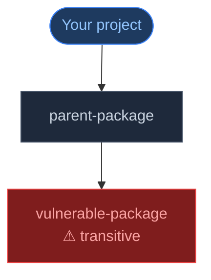
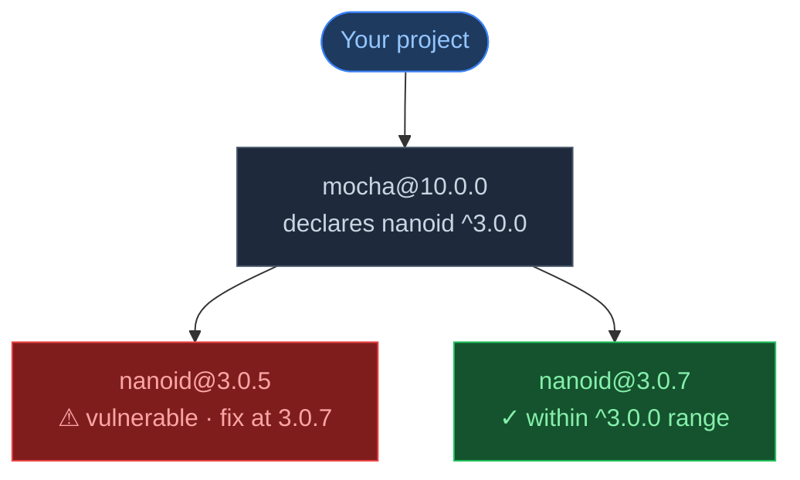
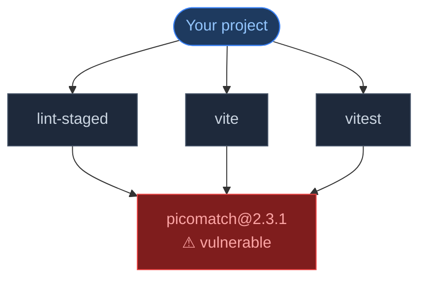
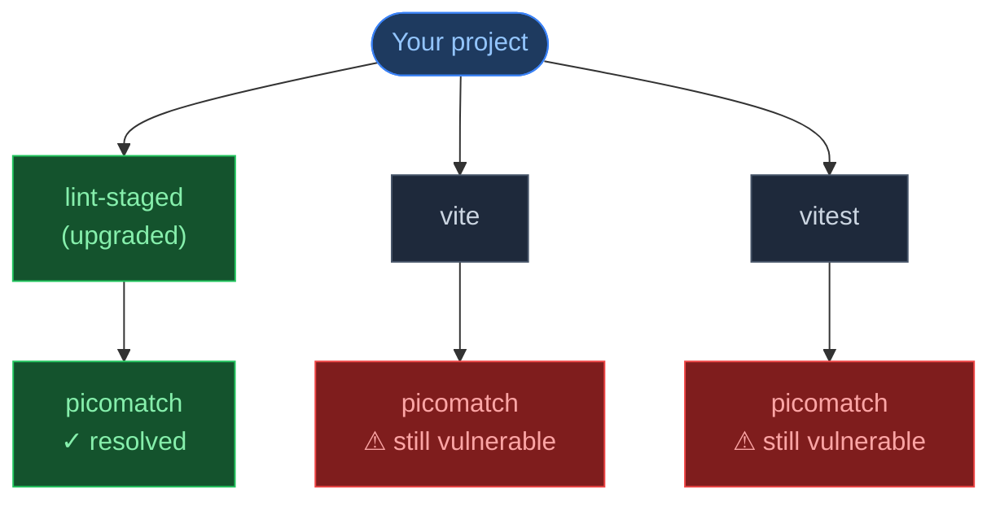
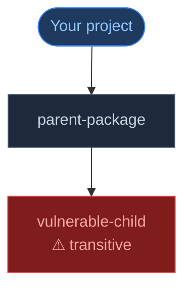

import Tabs from '@theme/Tabs';
import TabItem from '@theme/TabItem';

# Remediation Strategy

:::tip[New to CVE Lite CLI remediation?]
For a visual overview with diagrams and plain-English explanations, start with [How Remediation Works](how-remediation-works). This page covers the deeper technical detail.
:::

CVE Lite CLI is designed to turn vulnerability findings into concrete next actions. This page explains how the CLI decides which package to update, why direct and transitive findings are handled differently, and what it means when no confident automatic path is available.

The scanner is intentionally conservative. It prefers a specific command when the lockfile, advisory data, and package metadata support it. When they do not, it explains the nearest parent context instead of inventing a fix.

## Lockfiles are the source of truth

CVE Lite CLI scans resolved packages from the lockfile at the path you provide. The lockfile tells the CLI which package versions are actually installed and, when supported by the parser, how those packages relate to each other.

Supported lockfile scans include:

- `package-lock.json` for npm
- `pnpm-lock.yaml` for pnpm
- `yarn.lock` for Yarn
- `bun.lock` for Bun

If no lockfile exists, the CLI can fall back to `package.json`, but only for exact pinned direct dependencies. It cannot infer transitive packages from `package.json` alone because no resolved dependency tree exists there.

For parser-specific behavior, see [Parser Coverage](parser-coverage.md).

---

## Direct vs transitive findings

The CLI classifies vulnerable packages as:

- **Direct** when the package is declared by the project manifest.
- **Transitive** when the package is pulled in by another dependency.
- **Unknown** when the scanner cannot confidently determine the relationship from the available input.

This distinction matters because direct and transitive fixes use different package-manager behavior.

A direct dependency can usually be changed by updating the package itself:

<Tabs groupId="package-manager">
  <TabItem value="npm" label="npm" default>
    ```bash
    npm install vulnerable-package@fixed-version
    ```
  </TabItem>
  <TabItem value="pnpm" label="pnpm">
    ```bash
    pnpm add vulnerable-package@fixed-version
    ```
  </TabItem>
  <TabItem value="yarn" label="yarn">
    ```bash
    yarn add vulnerable-package@fixed-version
    ```
  </TabItem>
  <TabItem value="bun" label="bun">
    ```bash
    bun add vulnerable-package@fixed-version
    ```
  </TabItem>
</Tabs>

A transitive dependency should usually be changed by updating the parent that brought it in:



In that example, the actionable package is `parent-package`, not `vulnerable-package`.

---

## Direct dependency recommendations

For direct findings, the CLI starts with the advisory's fixed-version information and validates the target when registry data is available.

The recommendation must satisfy these checks:

- The target version must be newer than the installed version.
- The target must not be known vulnerable based on available advisory checks.
- Pre-release targets are skipped during registry-based parent remediation checks.
- If the original fixed-version hint is still vulnerable, the CLI moves forward to the next known non-vulnerable version when it can validate one.

When those checks pass, the CLI emits a package-manager-native command:

<Tabs groupId="package-manager">
  <TabItem value="npm" label="npm" default>
    ```bash
    npm install minimist@1.2.8
    ```
  </TabItem>
  <TabItem value="pnpm" label="pnpm">
    ```bash
    pnpm add minimist@1.2.8
    ```
  </TabItem>
  <TabItem value="yarn" label="yarn">
    ```bash
    yarn add minimist@1.2.8
    ```
  </TabItem>
  <TabItem value="bun" label="bun">
    ```bash
    bun add minimist@1.2.8
    ```
  </TabItem>
</Tabs>

In workspace monorepos, the command includes the appropriate workspace flag so the install targets the correct workspace rather than the project root:

<Tabs groupId="package-manager">
  <TabItem value="npm" label="npm" default>
    ```bash
    npm install -w packages/api minimist@1.2.8
    ```
  </TabItem>
  <TabItem value="pnpm" label="pnpm">
    ```bash
    pnpm add --filter ./packages/api minimist@1.2.8
    ```
  </TabItem>
  <TabItem value="yarn" label="yarn">
    ```bash
    yarn workspace api-package add minimist@1.2.8
    ```
  </TabItem>
  <TabItem value="bun" label="bun">
    ```bash
    bun add --filter packages/api minimist@1.2.8
    ```
  </TabItem>
</Tabs>

Direct findings are the only findings that `--fix` currently applies automatically. Transitive findings may still receive copy-and-run recommendations in normal scan output, but `--fix` does not auto-apply transitive parent changes.

### Why the CLI sometimes recommends a lower version

Occasionally the recommended fix version appears lower than the currently installed version. This is not a bug — it reflects a specific shape of OSV advisory data.

An OSV advisory can cover multiple disjoint version ranges. For example:

```
vulnerable: >= 1.0.0 < 1.5.0   fixed: 1.5.0
vulnerable: >= 2.0.0 < 2.5.0   fixed: 2.5.0
```

CVE Lite CLI extracts all `fixed` events from every range in the advisory and picks the lowest one as the initial hint. If the installed version is `2.1.0`, the lowest fixed version across both ranges is `1.5.0` — which is lower than what is installed.

For npm lockfiles with network access, the registry validation step corrects this: it scans published versions above the installed version and finds `2.5.0` as the actual fix target. The validated version replaces the raw OSV hint in the output.

For pnpm, Yarn, and Bun lockfiles, or when running with `--offline`, registry validation does not run. In those cases the raw OSV hint is used directly, and the downgrade may appear in the output.

**What to do if you see a downgrade recommendation:** check the advisory manually (the CVE or GHSA link is shown in verbose output and the HTML report) to identify the correct fixed version for your installed major version, then apply it directly.

---

## Transitive dependency recommendations

For transitive findings, the CLI tries to identify the parent package that can change the vulnerable child. This keeps the recommendation aligned with how package managers actually resolve dependency trees.

### npm: update parent within the current range

For npm lockfiles, CVE Lite CLI builds a logical dependency graph from `package-lock.json`. This allows the CLI to inspect the parent-child edge and read the dependency range the parent declares for the vulnerable child.

If the current parent already allows a known non-vulnerable child version inside its existing range, the CLI recommends updating the parent:



<Tabs groupId="package-manager">
  <TabItem value="npm" label="npm" default>
    ```bash
    npm update mocha
    ```
  </TabItem>
  <TabItem value="pnpm" label="pnpm">
    ```bash
    pnpm update --no-save mocha
    ```
  </TabItem>
  <TabItem value="yarn" label="yarn">
    ```bash
    yarn upgrade mocha
    ```
  </TabItem>
  <TabItem value="bun" label="bun">
    ```bash
    bun update mocha
    ```
  </TabItem>
</Tabs>

This asks the package manager to re-resolve the parent and its transitive child within the constraints already declared by the parent package. The CLI does not recommend installing `nanoid` directly here because that would add it as a direct dependency of your project, changing the manifest without fixing the real dependency relationship.

For npm workspaces, this graph keeps workspace-local package paths in the node identity. That matters for hoisted installs because a package may physically appear near the workspace root while still belonging to a specific workspace dependency path.

### npm: upgrade parent to a newer version

If no known non-vulnerable child version fits within the current parent range, the CLI checks newer non-pre-release versions of the parent package.

It looks for a parent version that:

- is newer than the installed parent version
- declares a dependency range that allows a known non-vulnerable child version
- no longer permits the currently installed vulnerable child version when that can be determined

<Tabs groupId="package-manager">
  <TabItem value="npm" label="npm" default>
    ```bash
    npm install parent-package@newer-version
    ```
  </TabItem>
  <TabItem value="pnpm" label="pnpm">
    ```bash
    pnpm add parent-package@newer-version
    ```
  </TabItem>
  <TabItem value="yarn" label="yarn">
    ```bash
    yarn add parent-package@newer-version
    ```
  </TabItem>
  <TabItem value="bun" label="bun">
    ```bash
    bun add parent-package@newer-version
    ```
  </TabItem>
</Tabs>

This means the remediation target is the package you directly or effectively control, while the vulnerable transitive package is resolved through the parent's dependency metadata.

### Fallback parent upgrade recommendations

For pnpm, Yarn, Bun, and deeper npm dependency paths, the CLI also tries a parent-upgrade fallback. It uses the shortest dependency path and checks package metadata for a newer direct parent that changes the relevant child or intermediate dependency range.

The fallback has two confidence levels:

- **Exact direct child** means the path is shaped like `project → parent → vulnerable-package`, and the newer parent version changes the vulnerable package range directly.
- **Best effort** means the vulnerable package is deeper in the chain, and the newer parent version changes an intermediate dependency that leads toward the vulnerable package.

Best-effort recommendations are useful, but they should be reviewed more carefully because the CLI is reasoning across a longer dependency path.

---

## Path-specific transitive remediation

A transitive package can appear more than once in the same lockfile through different parents:



When CVE Lite CLI finds a parent upgrade for one of those paths, the command is path-specific unless the known dependency paths prove that the upgrade covers every recorded path for that vulnerable package version.

For example, upgrading `lint-staged` resolves only one of the three paths:



In those cases, the suggested fix plan labels the command as path-specific and tells you to run the command, rescan, and review remaining paths separately.

The safest workflow for path-specific parent upgrades:

```bash
cve-lite /path/to/project
# run the suggested parent upgrade
cve-lite /path/to/project
```

If the same vulnerable package version still appears after the rescan, inspect the remaining dependency paths and address them separately.

---

## Why transitive findings should not be installed directly

Installing a vulnerable transitive package directly can make the output look actionable while creating the wrong dependency shape.



Running this installs `vulnerable-child` as a **direct** dependency of your project:

<Tabs groupId="package-manager">
  <TabItem value="npm" label="npm" default>
    ```bash
    npm install vulnerable-child@fixed-version
    ```
  </TabItem>
  <TabItem value="pnpm" label="pnpm">
    ```bash
    pnpm add vulnerable-child@fixed-version
    ```
  </TabItem>
  <TabItem value="yarn" label="yarn">
    ```bash
    yarn add vulnerable-child@fixed-version
    ```
  </TabItem>
  <TabItem value="bun" label="bun">
    ```bash
    bun add vulnerable-child@fixed-version
    ```
  </TabItem>
</Tabs>

This does not necessarily change what `parent-package` resolves or uses. The lockfile may still contain the vulnerable transitive copy under the parent, and the project now has a new direct dependency that the application may not use.

That is why CVE Lite CLI prefers:

- direct package upgrades for direct findings
- lockfile refresh when the parent range already covers a safe version
- parent package upgrades when the parent range has to change

---

## What no confident automatic path means

Some findings do not produce a copy-and-run command. That does not mean the finding is false. It means the CLI did not have enough reliable information to recommend one specific package-manager operation.

Common reasons include:

- The advisory has no usable fixed-version hint.
- Registry metadata could not identify a non-vulnerable upgrade target.
- The dependency path is missing or too ambiguous.
- The parent package has no newer non-pre-release version that changes the relevant dependency range.
- A parent upgrade only covers one known path while other paths to the same vulnerable package version remain.
- The package manager lockfile does not expose enough parent-child range information for this case.
- The scan is running in offline mode, where registry lookups for target validation are intentionally skipped.

When this happens, use the dependency path shown in verbose output or the HTML report to inspect the parent chain manually.

```bash
cve-lite /path/to/project --verbose
cve-lite /path/to/project --report
```

---

## Package-manager notes

### npm

npm receives the most detailed transitive remediation today because `package-lock.json` exposes enough information to build a logical parent-child graph and inspect declared ranges.

The CLI can recommend:

- `npm install <direct>@<version>` for direct findings
- `npm update <parent>` for transitive findings where a known non-vulnerable child fits the current parent range
- `npm install <parent>@<version>` when the parent itself must be upgraded

### pnpm

pnpm lockfiles provide strong resolved package data, but the current remediation logic does not yet use a pnpm-specific range graph equivalent to the npm path. The CLI can still recommend direct package upgrades and fallback parent upgrades when package metadata supports them.

### Yarn

Yarn lockfile parsing supports resolved package scanning, but dependency paths are more limited in the current implementation. The CLI can recommend direct package upgrades and may provide parent context when available.

### Bun

Bun lockfile parsing supports resolved package scanning. Like Yarn, transitive remediation is currently more limited than npm because the CLI does not yet have Bun-specific parent range resolution.

---

## Current limitations

CVE Lite CLI does not guarantee that a dependency upgrade is compatible with your application. It checks vulnerability and package metadata, not runtime behavior.

It also does not currently:

- apply transitive fixes automatically with `--fix`
- evaluate exploitability or runtime reachability unless you opt into static usage analysis
- resolve every deep transitive chain to a precise parent upgrade
- use package-manager-specific graph logic equally across npm, pnpm, Yarn, and Bun
- replace your test suite after dependency updates

The recommended workflow is to run the suggested command, run your project tests, and rescan:

```bash
cve-lite /path/to/project
npm test
cve-lite /path/to/project
```

---

## See also

- [How Remediation Works](how-remediation-works) — visual overview with diagrams and plain-English explanations
- [Offline Advisory DB](offline-advisory-db.md) — how to sync and use the local database
- [CLI Reference](cli-reference.md) — full flag documentation including `--verbose`, `--fix`, and `--fail-on`
